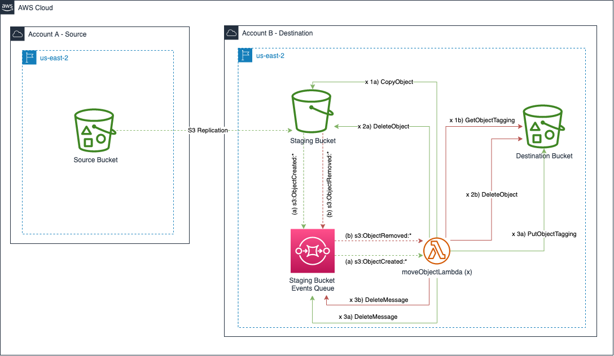

# aws-cdk-s3-replication-with-prefix

This cdk project demonstrates replicating S3 objects from a source bucket in one account
to a destination bucket in another account with a custom prefix applied to the replicated objects.

## Architecture

## Deployment

 * `npm run build`   compile typescript to js

### Context parameters
 * **sourceAccount** : The account id the source bucket live in
 * **sourceRegion** : The region the source bucket lives in
 * **destinationAccount** : The account id the destination bucket live in
 * **destinationRegion** : The region the destination bucket lives in
 * **destinationPrefix**: The prefix that you want objects replicated to in the destination bucket

### Stacks

1) Deploy the replication role to the source account
   1) `cdk deploy aws-cdk-s3-replication-with-prefix-destination-stack -c sourceAccount=<sourceAccount>  -c sourceRegion=<sourceRegion> -c sourceAccount=<sourceAccount> -c -destinationAccount=<destinationAccount> -c destinationRegion=<destinationRegion> -c destinationPrefix=<destinationPrefix>`
2) Deploy the destination bucket and move object lambda to the destination account
   1) `cdk deploy aws-cdk-s3-replication-with-prefix-destination-stack -c sourceRegion=<sourceRegion> -c sourceAccount=<sourceAccount> -c -destinationAccount=<destinationAccount> -c destinationRegion=<destinationRegion> -c destinationPrefix=<destinationPrefix>`
3) Deploy the source bucket to the source account with replication rules to the destination account
   1) `cdk deploy aws-cdk-s3-replication-with-prefix-source-stack -c sourceRegion=<sourceRegion> -c sourceAccount=<sourceAccount> -c -destinationAccount=<destinationAccount> -c destinationRegion=<destinationRegion> -c destinationPrefix=<destinationPrefix>`